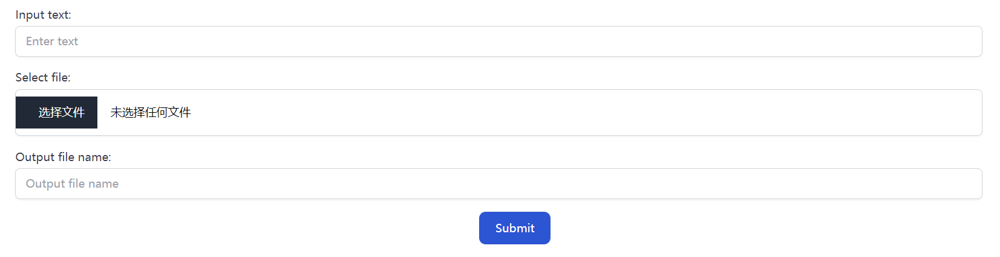
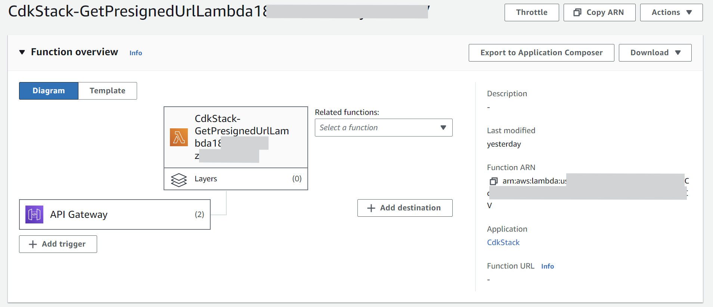
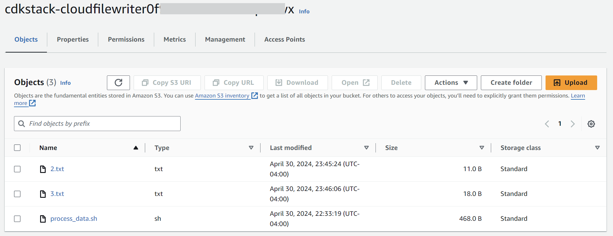
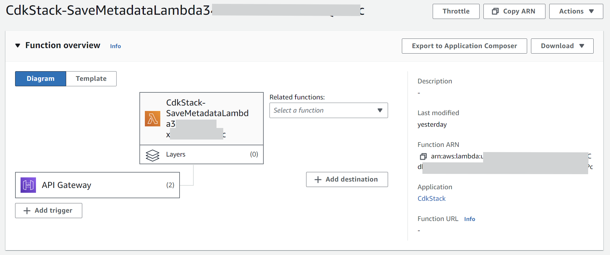
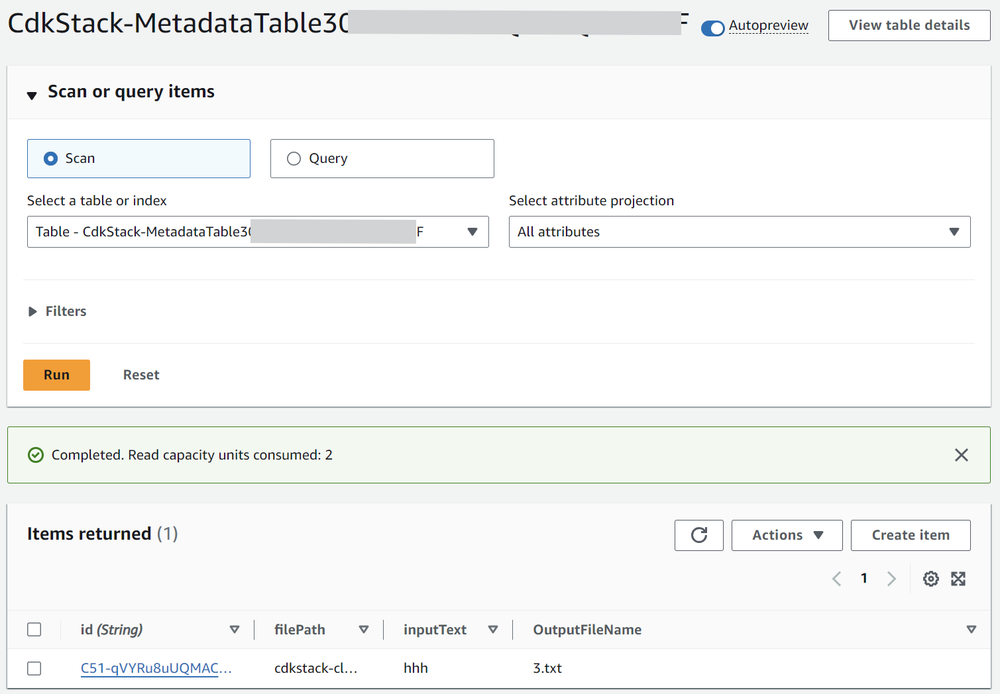
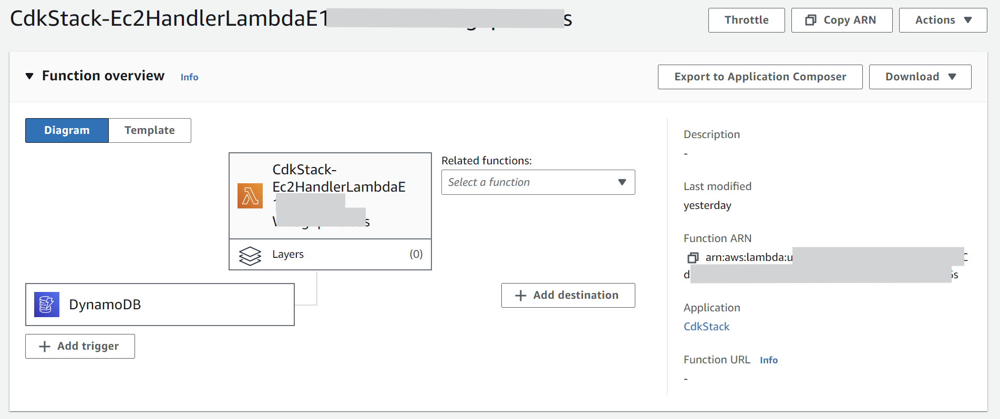
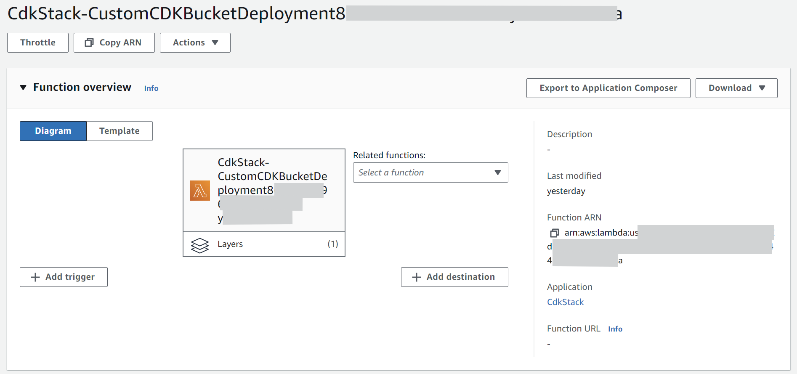

# Cloud File Writer

This project demonstrates the ability to append text to a file, with all operations being performed in the cloud using AWS services. The project is written in TypeScript and utilizes the AWS SDK for interfacing with AWS services and the AWS CDK for creating the infrastructure.

Live demo: [Cloud File Writer](https://main.d1eos5bt6pnhr6.amplifyapp.com/)

## Features

- Allows users to upload a file, input the text to append, and specify the output file name.



- A Lambda function provides a pre-signed URL to authorized users for file uploads.
    - The browser uploads the file to an S3 bucket using the pre-signed URL.
    - 
    - 
- A Lambda function stores the metadata of the file in DynamoDB.
    - 
    -  
- A Lambda function controls the EC2 instance to append text to the file, triggered by the metadata stored in DynamoDB.
    - The EC2 instance downloads and executes a bash script from S3 to append text.
    - 
- Uses CDK to create an S3 bucket, a DynamoDB table, three Lambda functions, and to store the bash script in S3.
    -  
- Frontend deployed as an Amplify app.

## Technologies

### Frontend
- React with TailwindCSS, Flowbite for styling.
- Axios for making HTTP requests.
- AWS Amplify for deployment.

### Backend
- AWS Lambda for managing the pre-signed URL, storing metadata, and controlling the EC2 instance.
- AWS S3 for storing files and bash scripts.
- AWS DynamoDB for metadata storage.
- AWS EC2 for appending text to files.
- AWS CDK for infrastructure creation.

## Setup

1. Clone the repository.
2. Install the dependencies.

   Install for the frontend:
   ```bash
   cd frontend
   npm install
   ```

   Install for the backend:
   ```bash
   cd backend
   npm install
   ```

   Install for the CDK:
   ```bash
   cd cdk
   npm install
   ```

3. Create IAM user with the following permissions:
   - AdministratorAccess	
   - AmazonDynamoDBFullAccess
   -  AmazonEC2ContainerRegistryFullAccess	
   -  AmazonS3FullAccess	
   -  AmazonSSMFullAccess	
   -  AWSCloudFormationFullAccess	
   -  AWSLambda_FullAccess
   -  IAMFullAccess

4. Configure the AWS CLI with the IAM user credentials.
   ```bash
   aws configure
   ```

5. Deploy the CDK stack.
   ```bash
   cdk deploy
   ```

6. Create a `.env` file in the `frontend` directory and add the output API URL from the CDK stack.:
   ```bash
   REACT_APP_API_URL=<API_URL>
   ```
   
7. Deploy the frontend.
   
   Local development:
   ```bash
   cd frontend
   npm run dev
   ```
   Production build: deploy as Amplify app.